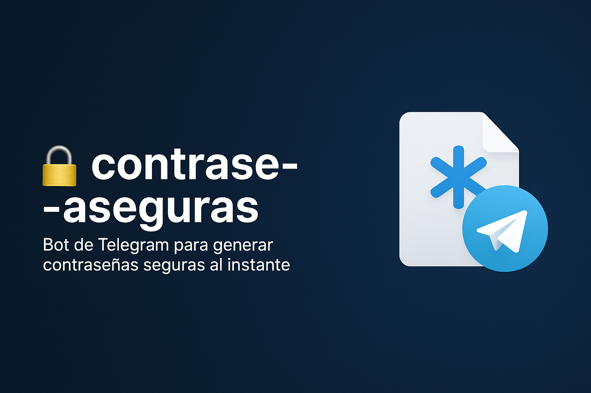

# 🔐 contrase-aseguras




Bot de Telegram para generar contraseñas seguras al instante.

---

## 📦 Tecnologías utilizadas

- Python 3.x  
- python-telegram-bot  
- python-dotenv  

---

## ⚙️ Instalación

1. Clona el repositorio:
```bash
git clone https://github.com/Jesush02/contrase-aseguras.git
cd contrase-aseguras

Crea un entorno virtual e instálalo:

python -m venv venv
venv\Scripts\activate
pip install -r requirements.txt

Crea un archivo .env con tu token

TELEGRAM_TOKEN=TU_TOKEN_DEL_BOT

Ejecuta el bot:

python GenPasswordTg.py

| Archivo            | Descripción                                 |
| ------------------ | ------------------------------------------- |
| `GenPasswordTg.py` | Lógica del bot de generación de contraseñas |
| `contraseñas.txt`  | Historial de contraseñas generadas          |
| `.gitignore`       | Archivos que no se suben al repositorio     |
| `requirements.txt` | Dependencias necesarias                     |


✨ Autor
Creado por Jesush02
